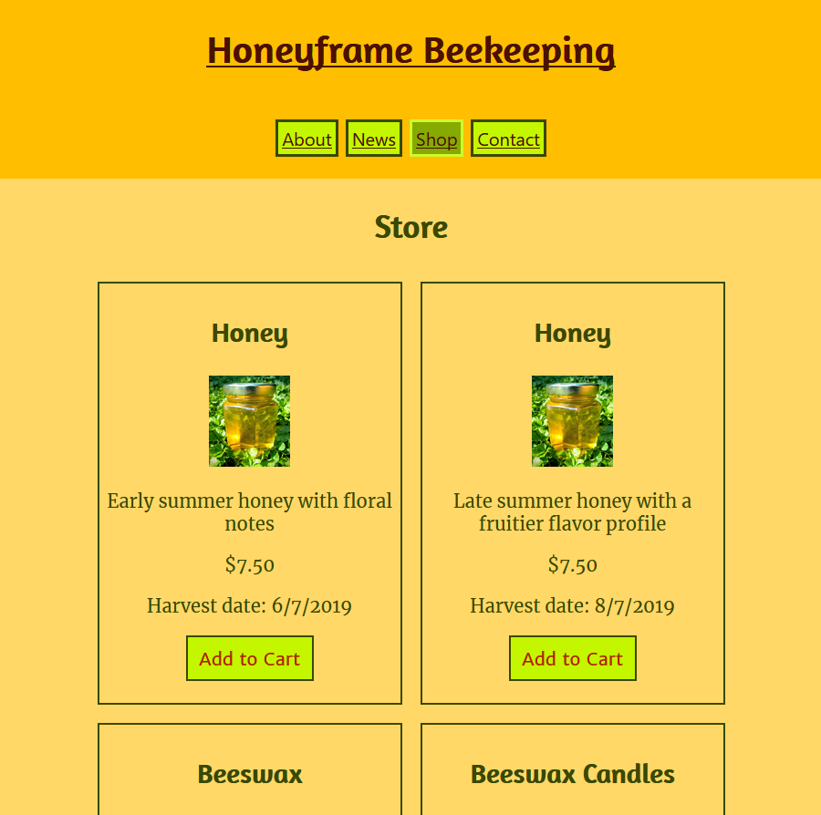

# Honeyframe

A mock storefront and blog combination for a fictionalized small business selling honey and other bee products, the skeleton of which can potentially be repurposed for other small businesses.

## Live

https://honeyframe.parkinsonsp42.now.sh/

## API Repo

https://github.com/sam-parkinson/honeyframe-server

## Screenshots

## Technologies USed

React, HTML, CSS, JavaScript

## Image Credits

All images used with permission from https://www.instagram.com/westavehoney/