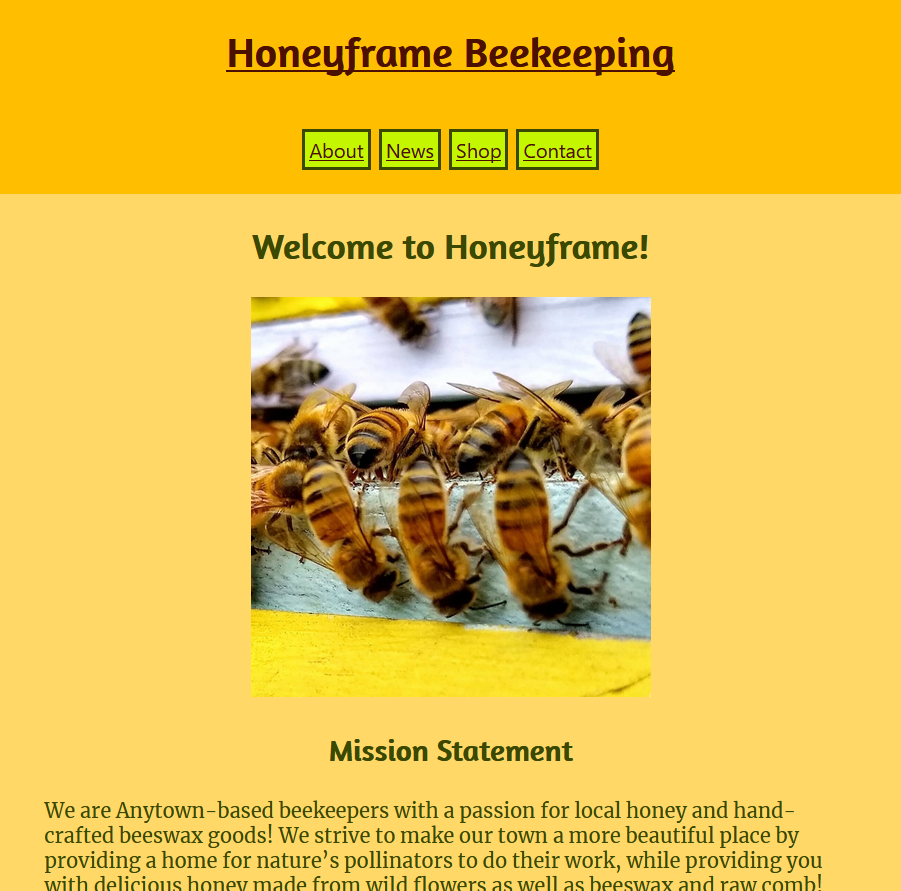

# Honeyframe

A mock storefront and blog combination for a fictionalized small business selling honey and other bee products, the skeleton of which can potentially be repurposed for other small businesses.

## Live

https://honeyframe.parkinsonsp42.now.sh/

## API Repo

https://github.com/sam-parkinson/honeyframe-server

## Screenshots

## Technologies Used

React, HTML, CSS, JavaScript, Stripe API, Stripe Checkout

## Demo Information

To test the admin page and blog posting function, please use the values provided as placeholders on the demo page:
  - Username: beekeeper
  - Password: testpassword

To process test payments via the Stripe API, please use the following as test values:
  - Card number: 4242 4242 4242 4242
  - Expiration date: Any date in the future (MM/YY)
  - CCV: Any three-digit number

## Image Credits

All images used with permission from https://www.instagram.com/westavehoney/
